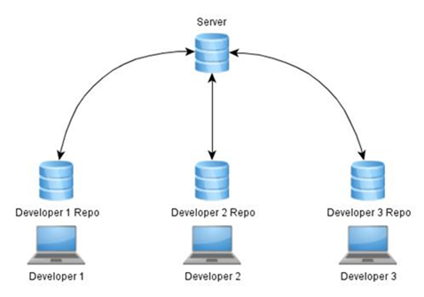

# Version Control Systems (VCS)
A VCS is a system designed to store previous versions of files.  Much like Gmail saves drafts while you write emails, a VCS can save snapshots of your code as you develop features.  The difference is that a VCS can recall any saved version at any time.  You could create a project, iterate through 100 versions, and then find a bug.  Using your VCS, you work your way backwards through the code’s history until you find a typo in revision 33 caused the whole problem.  A VCS is a powerful way of storing history, especially for code.
Many VCS’s also integrate issue tracking, release management and support for storing experimental builds that will never see the light of day.  Our current system supports all of these, but we will get there in due time.

# VCS – Centralized or Distributed
There are two kinds of VCS’s – Centralized and Distributed.  The main differences between the two are where the code history is stored and how a developer interacts with the system to update code.

## Centralized

A centralized VCS works on the basis that there is exactly one repository of code to interact with.  This usually is a server somewhere on your company’s network.  The server might create backups of its repository, but make no mistake, that server is the only one you will likely ever work with.  Consequently, developers using a centralized system are entirely dependent on the server to be able to get work done (All hail the hypnoserver!).
In general, developers might check out a copy of a version of code from the server.  This may also give them permission to make changes to those files and re-upload them to the server.  Work may be done on the developers computers, but everything must eventually come from and go to the server to be stored.  The server is the warden.  The server is the librarian.  The server is the historian.  The server is the weakest link in the chain.

## Distributed

A distributed VCS works on the basis that everyone has a copy of the repository.  This means that your local computer might house all the code history that is present on the server and possibly more.  Steve has the code and the history.  I have the code and the history.  So do you.  This reduces the dependency on a server but increases the importance of synchronization.
In general, developers check out a version of code from themselves, make the changes on their own computers, save the new versions on their own computers, and then share those changes if they feel like it (note we at Casco require all official versions of code to be reproducible and stored in a redundant manner).   A server may be entirely optional if the Local Area Network is set up correctly. 

 
However, this amount of freedom can sometimes border on anarchy.  As such, we have decided to use a distributed VCS and create workflows that function in a centralized manner.
 
This way, redundancy is accomplished by simply having multiple developers clone the repository and accuracy is achieved by synchronizing with the server.

# Git VCS
Git is a distributed version control system, not an insult.  This VCS was designed to accommodate the development of Linux and is still used today.  It is also one of the top choices for Open Source development of code.  The system encourages code branching and experimentation, allowing multiple versions of code with separate histories to exist at the same time in a logical manner.  This allows us to designate branches for specific roles.  For example, the master branch might be reserved for official release versions of code.  Git also uses a very small amount of hard drive space relative to the number of versions it may store.

TL;DR for below {
    Repository: the data structure of your code, including a .git folder in the root directory
    Commit: a particular saved state of the repository, this includes all files and additions
    Branch: a means of separating various commits, having a unique history. This is primarily used for separating development and stable branches.
    Push: update the remote repository with your local changes
    Pull: update your local repository with the remote changes
    Clone: retrieving a local copy of a repository to modify
    Branch/Fork: duplicating a pre-existing repository to modify, and to compare against the original
    Merge: combining various changes from different branches/commits/forks into a single history
}

### ●	NODES, BRANCHES, AND WORKING COPIES

Nodes, branches, and working copies allows us to visualize how changes progress with our code.

Repositories - Repositories store all of the history for your code. You have you local repository where all local changes you make are put and saved. The guy working with you also has a local repository. How we make sure everyone working on the code stays in sync is with the online server or remote.

Nodes - Nodes refer to the various points in time you saved and commited changes to your repository (a “version” of the repository basically). To roll back or view a set of changes, just look for the node where the changes were made.

Branches - Branches connect the nodes to show the path of changes you took to get from node A to node B. Branches are also aptly named. They can divert from the main line and merge back in.  You can develop a whole experimental set of code, and then decide to leave it out of the main project without deleting it.

Working Copy - When jumping between branches, you are essentially taking the version of code on that branch and creating a local version on your local repository. This then becomes your working copy. Any changes made will not affect the remote version unless you choose to push those changes.

### ●	COMMIT
	
Commiting changes allows others to access and see the changes you make to the code. Commits should be made with a description of what was added and/or what was changed.

-Staging Changes:
	After you have finished making changes, you need to stage them to be committed. You have the option to selectively choose what gets committed and what does not. If you choose to stage a file and then make additional changes before committing, You will find that the latest change you made has been added to the potential changes you can stage. 

-Commiting Changes
When commiting changes, a new node will be made on your computer and move the branch to that node. 

### ●	PUSH/PULL
	
The act of pushing and pulling allows us to keep the different repositories of everyone working, as well as the server’s, in sync.

Pushing and Pulling code is how we interface with the server. Pushing means we are taking the changes we made on our local repository and “pushing” them to the server. Likewise, pulling is where we “pull” the recent changes from the server and apply them to our own local repository.

### ●	BRANCHING/FORKING / MERGING

Branching and merging allows us to take bring the changes on one branch to another. We do this to either begin working separately or once we have finished working on a separate version and want to bring back the changes made.

Branching and merging is as simple as clicking a button. However, when merging, make sure all changes are accounted for. Conflicting changes will cause problems when attempting to merge.